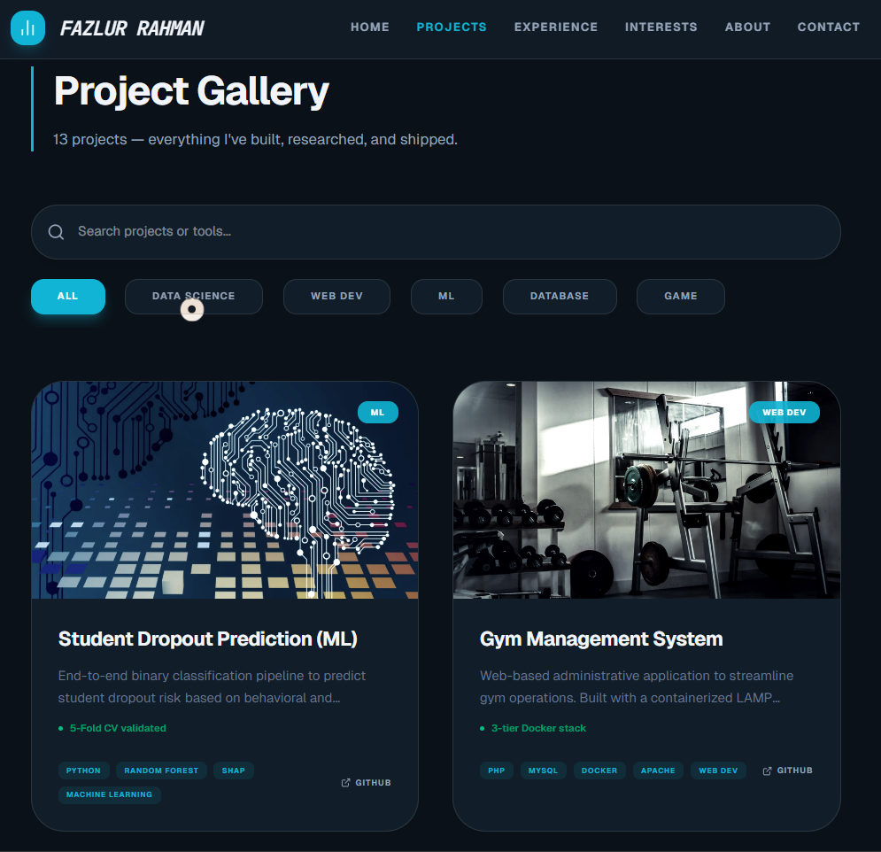

# [Fazlur Rahman](https://fazlurrahman.vercel.app) — Portfolio Website 

• [**Website**](https://fazlurrahman.vercel.app) • 

---

## Preview

---

## 🌟 Website Motivation

I built this portfolio to demonstrate not only my projects but also my ability to build **production-ready, performant, and maintainable software systems**.

### Core Technical Achievements

- **Zero-Runtime CSS**: Leveraged **Tailwind CSS v4** for efficient styling and fast load times.  
- **Physics-Based UI**: Implemented smooth, staggered animations using **Framer Motion** for a refined user experience.  
- **Automated Data Pipelines**: Built an asset optimization workflow using Node.js and **Sharp** to convert high-resolution images to WebP, improving load performance and reducing LCP (Largest Contentful Paint).  
- **Interactive Data Visualization**: Developed dashboards using **Recharts** to visualize metrics such as IoT logs, ML model performance, and transaction data.  
- **Responsive Architecture**: Designed a fully responsive, modular system featuring a custom **Terminal UI** and an **Interactive World Map**.  

---

## 🛠️ Tech Stack & Architecture

### Frontend
- **React 19**: Utilizing modern concurrent rendering features and hooks.  
- **TypeScript**: Ensuring type safety across application data layers (project metadata, geo-data).  
- **Geist & JetBrains Mono**: Selected for clear and readable technical typography.  
- **Lucide Icons**: Used for consistent and clean interface elements.  

### Data Engineering & Machine Learning
- **ML Pipelines**: Built using Scikit-Learn, TensorFlow, and OpenCV.  
- **Model Interpretation**: Applied SHAP and LIME techniques.  
- **Databases**: Worked with MySQL, MongoDB, and Neo4j (polyglot persistence).  
- **DevOps**: Dockerized environments for reproducible builds and deployments.  
- **Real-time Systems**: Simulated MQTT-based IoT data ingestion using Python publishers.  

---

## 📂 Project Highlights

| Category | Key Projects | Highlights |
| :--- | :--- | :--- |
| **Machine Learning** | Student Dropout Prediction, Hand Gesture Recognition | Applied SHAP/LIME for interpretability and implemented real-time CNN-based vision |
| **Full-Stack Web** | Gym Management (LAMP), Bloom & Basket (E-commerce) | Dockerized applications with authentication, CSRF protection, and NGINX proxy |
| **Data & IoT** | Energy Monitoring, IoT DB Cluster | Multi-database synchronization with MQTT ingestion and alerting mechanisms |
| **Blockchain** | Secure Transaction System | Simulated Ethereum transactions using Ganache and Web3.php |

---

## 📫 Connect With Me

- **Email**: [fazlurrahaman365@gmail.com](mailto:fazlurrahaman365@gmail.com)  
- **LinkedIn**: [Fazlur Rahman](https://linkedin.com/in/YOUR-LINKEDIN-HERE)  
- **Location**: Messina, Italy (University of Messina)  

---

Built with ❤️ by Fazlur Rahman.  
© 2024. All Rights Reserved.

